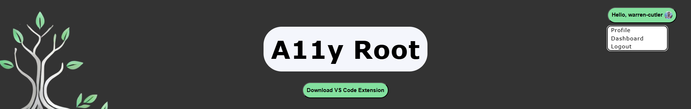
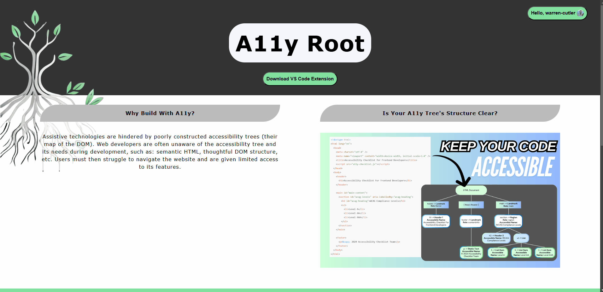
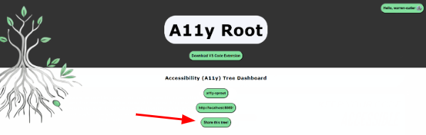
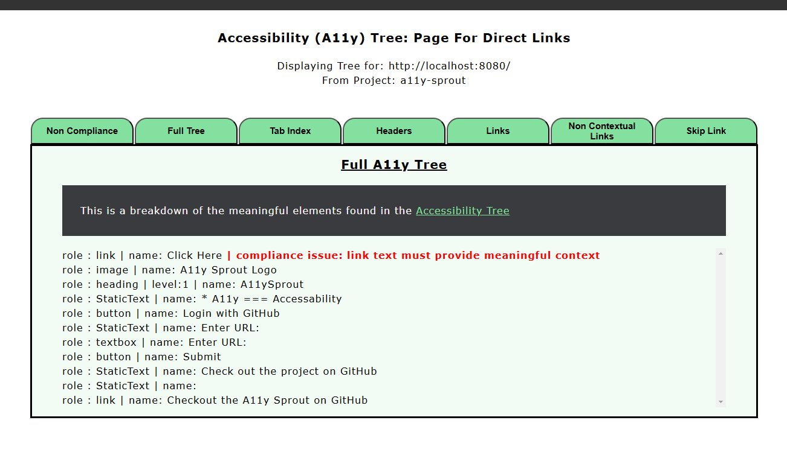

 

# A11y Root Webpage 

[A11y Root](https://a11yroot.dev/): A Visual Studio Code extension rooted in accessibility. 

A11y Root is an open source VS code extension and accompanying webpage designed to enable developers and interdisciplinary teams to collaboratively address user accessibility of their projects throughout the development process.

At its root, the [VS Code extension](https://github.com/oslabs-beta/A11y-Root-Extension) allows developers to generate and receive feedback on the accessibility tree of a webpage, whether in production or in a dev environment. Check out the [README](https://github.com/oslabs-beta/A11y-Root-Extension/blob/dev/README.md) for the extension for more details on getting started.

Once a tree is generated, it is stored in a database and associated to the developer's github account (via Github OAuth). This enables a developer to access the same tree/feedback on the A11y Root webpage, as well as create a direct link to the tree which can be shared with other project contributors, such as designers, managers, or key stakeholders.

## Why build your project with A11y Root?

A11y Root integrates **WCAG compliance** tools directly into the development workflow. The extension provides:

- **Accessibility Tree Visualization**: Exposes the full accessibility tree, allowing developers to understand how assistive technologies interact with the DOM.
- **Real-Time Analysis**: Detects WCAG guideline issues in projects and provides actionable insights.
- **Team Collaboration**: Enables sharing of accessibility reports through public links for seamless collaboration.
- **Simplified Development Workflow**: Makes accessibility a priority from day one.

## Main Features of the A11y Root Webpage

The home page of [A11y Root](https://a11yroot.dev) provides a link to download the VS Code Extension.

Additionally, users can sign in with GitHub to gain access to more features:

 

### Developer Dashboard

The Dashboard provides access to any projects and pages that a user has previously created through the extension. Simply select from the available dropdowns to review the accessibility tree and feedback in browser.

 

### Direct Links

On the developer's dashboard, there is a "Share this tree" button. This will generate a direct link to that specific tree/feedback.

 

The direct link allows *anyone with the link* to view the tree; no login needed. This can be useful to share the accessibility feedback with contributors and stakeholders who may not have direct access to the dev environment repo.

 

### User Profile Page

Logged in users also have access to a profile page. Currently, this provides the ability to delete an existing project (removing all of its pages' trees from our database), or delete your account completely (removing the user and all associated projects/pages from our database).

## Community Contributions

A11y Root is an open source product! Contributions and feedback from the community is welcomed. Please look at our [CONTRIBUTING.md](./CONTRIBUTING.md) for how to get involved.

## Key Contributors

This product was initially created and deployed by the following team of developers.

<table>
<td align="center">
  
   
  <b>Tamika Blakey</b>
   
  <a href="https://github.com/jamagachi">GitHub</a>
  <a href="https://www.linkedin.com/in/tamikablakey/">LinkedIn</a>
</td>

<td align="center">
  
   
  <b>Ian Buchanan</b>
   
  <a href="https://github.com/ianbuchanan42">GitHub</a>
  <a href="https://www.linkedin.com/in/ian-buchanan-accessibility/">LinkedIn</a>
</td>

<td align="center">
  
   
  <b>Claire Chen</b>
   
  <a href="https://github.com/claireandj666">GitHub</a>
  <a href="https://www.linkedin.com/in/claire-chen11/">LinkedIn</a>
</td>

<td align="center">
  
   
  <b>Warren Cutler</b>
   
  <a href="https://github.com/warren-cutler">GitHub</a>
  <a href="https://www.linkedin.com/in/warren-cutler/">LinkedIn</a>
</td>

<td align="center">
  
   
  <b>Jeet Patel</b>
   
  <a href="https://github.com/Jeetp45">GitHub</a>
  <a href="http://www.linkedin.com/in/jeetpatel-a83820254">LinkedIn</a>
</td>

</table>

## Licensing and Acknowledgments

We would like to recognize [OSLabs](https://www.opensourcelabs.io/), a nonprofit tech accelerator, for their support and resources that enabled the launch of this product.

We'd also like to acknowledge the [Puppeteer Team](https://pptr.dev/) - without the use of their robust tools, A11y Root would not have been possible.

This project is licensed under the Apache License, Version 2.0. See the [LICENSE](./LICENSE) file for details.
